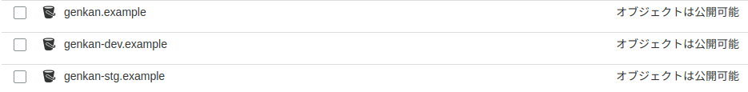
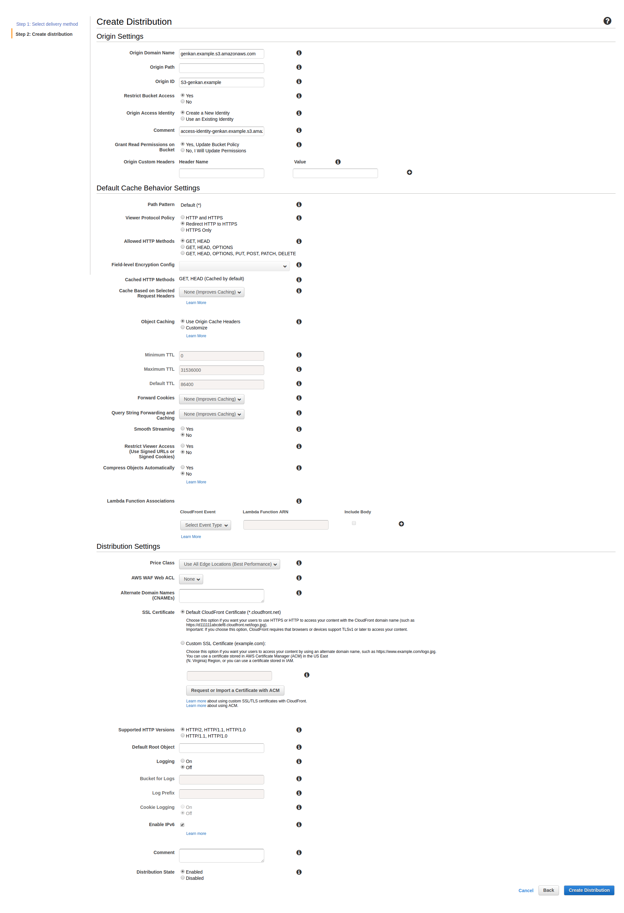
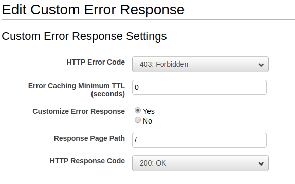
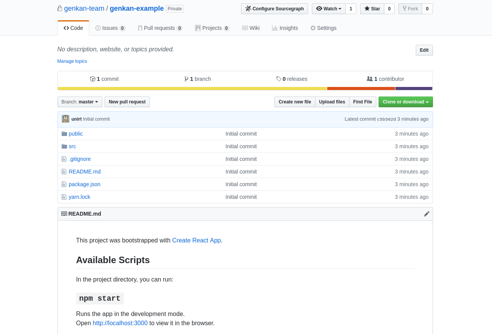
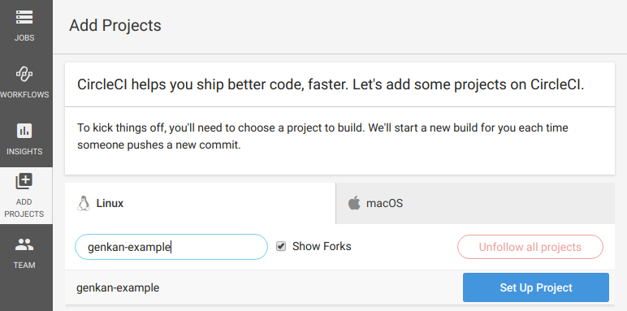
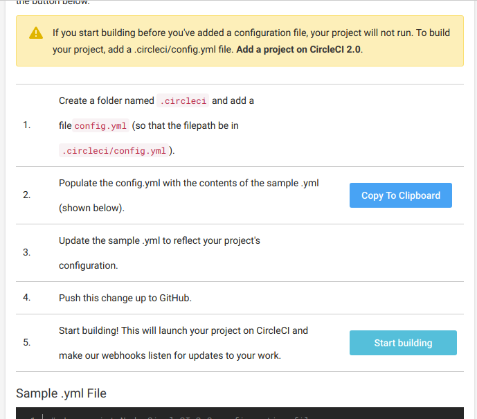
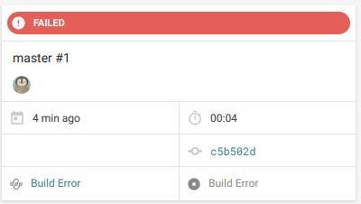

# S3 + CloudFront + CircleCI on GitFlow で構成する快適な開発&デプロイ環境
初めまして！  
ソフトウェアエンジニアでインターン生の都築です。  
サーバサイドやDevOpsを中心にフロント、インフラ、たまにはハードウェアまで広く薄く(?)やっています。  
今回はGitFlowに沿ってReactアプリケーションを開発して、CircleCIでS3に自動デプロイ、CloudFrontでCDNにのせるという一連の流れについて書いてみたいと思います。  

## 課題と方針
創業初期は人数が少なく「それぞれがローカルで開発して動かしてみる -> ある程度まとまったら手動でビルドしてデプロイ」という開発フローで回っていましたが、より効率的な開発をしていくために開発環境、デプロイ環境を見直すことになりました。  
まず、Git周りを整理するため「[A successful Git branching model](https://nvie.com/posts/a-successful-git-branching-model/)」を導入することにしました。  
GitFlowはその導入を支援するツールですが、ここでは便宜的に「A successful Git branching model」をGitFlowと呼ぶことにします。  
そしてCIも導入することになりました。  
いくつか選択肢はありましたが、手軽に導入できそうなCircleCIを選びました。

## 前提と注意
- AWSアカウントを持っている前提です。
- 今回は独自ドメインの設定は行いません。
- CircleCI用のIAMユーザーを作ってください。 
権限はS3のフルアクセスとCloudFrontのフルアクセスを与えてください。
- GitHubと連携したCircleCIアカウントを作ってください。

## 大まかな流れ
1. [S3バケットを作る](#S3バケットを作成する)
2. [CloudFront Distributionを作る](#CloudFront-Distributionを作る)
3. [GitHubリポジトリとCircleCIプロジェクトを作る](#GitHubリポジトリとCircleCIプロジェクトを作る)
4. [CircleCIの設定を行う](#CircleCIの設定を行う)
5. [GitFlowに沿って開発してみる](#GitFlowに沿って開発してみる)

## S3バケットを作成する
まずはS3バケットを作りましょう。    
  
- 本番用: `genkan.example`
- ステージング用: `genkan-stg.example`
- 開発用: `genkan-dev.example`

の3つを作ります。  
それぞれバケットホスティングも有効にしておきましょう。  

## CloudFront Distributionを作る
本番用の`genkan.example`に対応するもののみ作ります。  
今回は以下のように設定しました。  
  
Distributionの作成については[こちら](https://qiita.com/kohatang/items/26d9df4a348d44bbb7d4)が詳しいです。  
ついでにCustom Error Responseについても設定しておきましょう。  
  
これは以前「CloudfrontReactアプリケーション上でハードリロードをすると403が返ってくる」という現象に遭遇し、それに対処するため設定しました。 [参考](https://dev.classmethod.jp/cloud/aws/s3-cloudfront-spa-angular-403-access-denied/) 

## GitHubリポジトリとCircleCIプロジェクトを作る
GitHubリポジトリを作ります。  
とりあえずクローンして`create-react-app`してプッシュしておきます。 
```bash
git clone git@github.com:genkan-team/genkan-example.git
cd genkan-example
npx create-react-app .
git add .
git commit -m "Initial commit"
git push
```
  

次にCircleCIのセットアップを行います。  
`Add Projects`からリポジトリを選択(`Set Up Project`) 
  
そして`Start building`してみましょう。  
  
`.circleci/config.yml`を設定していないので`FAILED`になっていると思います。  
  
次で設定していきます。

## CircleCIの設定を行う
### CircleCIがデプロイできるようにする
まずCircleCIのEnvironment VariablesにCircleCI用のIAMの
- `AWS_ACCESS_KEY_ID`
- `AWS_SECRET_ACCESS_KEY`  

を設定します。  
こうすることでCircleCI上でAWS CLIを用いてデプロイすることが可能になります。
### 設定ファイルを編集する
`.circleci/config.yml`を設定していきます。  
```yml

```

## GitFlowに沿って開発してみる