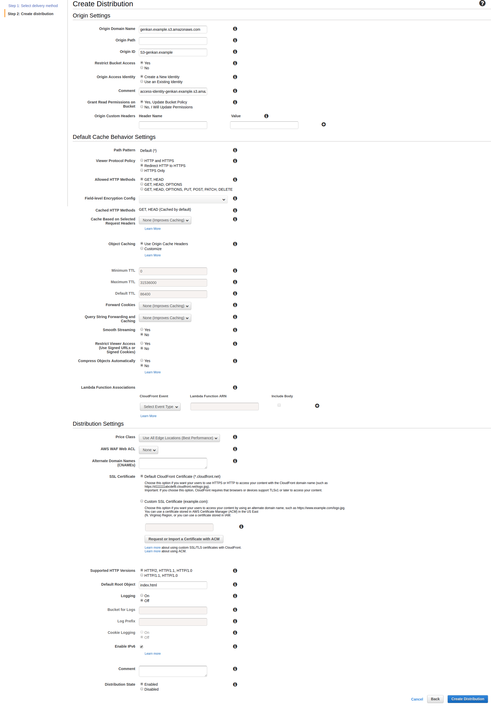
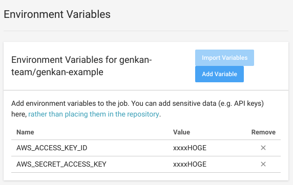
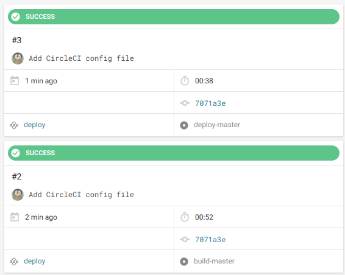
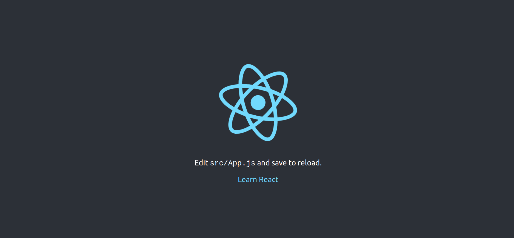
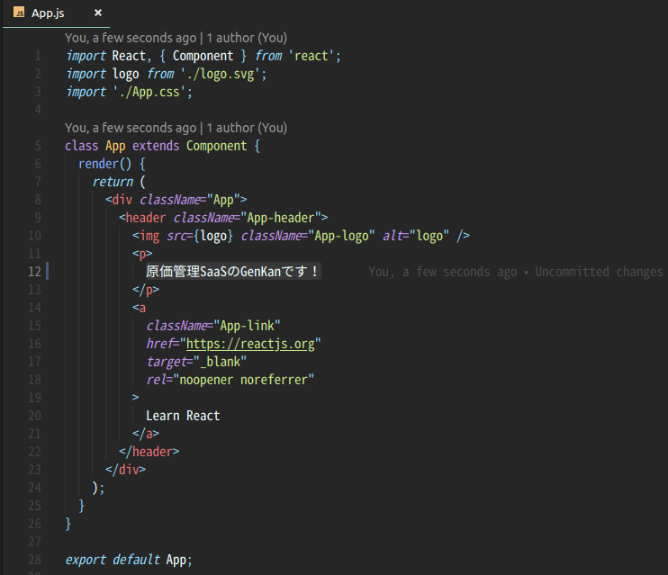
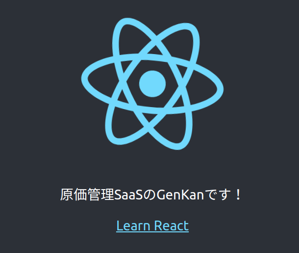

# S3 + CloudFront + CircleCI on GitFlow で構成する快適な開発&デプロイ環境
初めまして！  
ソフトウェアエンジニアでインターン生の都築です。  
サーバサイドやDevOpsを中心にフロント、インフラ、たまにはハードウェアまで広く薄く(?)やっています。  
今回はGitFlowに沿ってReactアプリケーションを開発して、CircleCIでS3に自動デプロイ、CloudFrontでCDNにのせるという一連の流れについて書いてみたいと思います。  

## 課題と方針
創業初期は人数が少なく「それぞれがローカルで開発して動かしてみる -> ある程度まとまったら手動でビルドしてデプロイ」という開発フローで回っていましたが、より効率的な開発をしていくために開発環境、デプロイ環境を見直すことになりました。  
まず、Git周りを整理するため「[A successful Git branching model](https://nvie.com/posts/a-successful-git-branching-model/)」を導入することにしました。  
GitFlowはその導入を支援するツールですが、ここでは便宜的に「A successful Git branching model」をGitFlowと呼ぶことにします。  
そしてCIも導入することになりました。  
いくつか選択肢はありましたが、手軽に導入できそうなCircleCIを選びました。

## 前提と注意
- AWSアカウントを持っている前提です。
- 今回は独自ドメインの設定は行いません。
- CircleCI用のIAMユーザー(以下では`circle_ci`)を作ってください。権限はS3のフルアクセスとCloudFrontのフルアクセスを与えてください。
- GitHubと連携したCircleCIアカウントを作ってください。

## 大まかな流れ
1. [S3バケットを作りポリシーを編集する](#S3バケットを作りポリシーを編集する)
2. [CloudFront Distributionを作る](#CloudFront-Distributionを作る)
3. [GitHubリポジトリとCircleCIプロジェクトを作る](#GitHubリポジトリとCircleCIプロジェクトを作る)
4. [CircleCIの設定を行う](#CircleCIの設定を行う)
5. [GitFlowに沿って開発してみる](#GitFlowに沿って開発してみる)

## S3バケットを作りポリシーを編集する
### S3バケットを作る
まずはS3バケットを作りましょう。    
  
- 本番用: `genkan.example`
- ステージング用: `genkan-stg.example`
- 開発用: `genkan-dev.example`

の3つを作りました。  
パブリックアクセス設定についてはとりあえず全て`False`でいいと思います。  
それぞれバケットホスティングも有効にしておきましょう。  
### バケットポリシーを編集する
例として`genkan-dev.example`のバケットポリシーを挙げておきます。
```json
{
    "Version": "2012-10-17",
    "Id": "Policy1000000000000",
    "Statement": [
        {
            "Effect": "Allow",
            "Principal": {
                "AWS": "arn:aws:iam::{AWSアカウントID}:user/circle_ci"
            },
            "Action": "s3:*",
            "Resource": [
                "arn:aws:s3:::genkan-dev.example",
                "arn:aws:s3:::genkan-dev.example/*"
            ]
        },
        {
            "Effect": "Allow",
            "Principal": "*",
            "Action": "s3:GetObject",
            "Resource": "arn:aws:s3:::genkan-dev.example/*"
        }
    ]
}
```
`{AWSアカウントID}`には適切なIDをおいてください。  
1つ目のStatementはCircleCIがデプロイできるように設定しています。  
2つ目のStatementはアプリケーションを公開するために設定しています。  
この設定を作成したS3バケット全てにしてください。  
バケットポリシーについては[こちら](https://morizyun.github.io/infrastructure/aws-s3-bucket-policy.html)が分かりやすいです。
## CloudFront Distributionを作る
本番用の`genkan.example`に対応するもののみ作ります。  
今回は以下のように設定しました。  
  
Distributionの作成については[こちら](https://qiita.com/kohatang/items/26d9df4a348d44bbb7d4)が詳しいです。  
`Default Root Object`には`index.html`を指定するのをお忘れなく。  
ついでにCustom Error Responseについても設定しておきましょう。  
  
これは以前「CloudfrontReactアプリケーション上でハードリロードをすると403が返ってくる」という現象に遭遇し、それに対処するため設定しました。 [参考](https://dev.classmethod.jp/cloud/aws/s3-cloudfront-spa-angular-403-access-denied/) 

## GitHubリポジトリとCircleCIプロジェクトを作る
GitHubリポジトリを作ります。  
とりあえずクローンして`create-react-app`してプッシュしておきます。 
```bash
git clone git@github.com:genkan-team/genkan-example.git
cd genkan-example
npx create-react-app .
git add .
git commit -m "Initial commit"
git push
```
  

次にCircleCIのセットアップを行います。  
`Add Projects`からリポジトリを選択(`Set Up Project`) 
  
そして`Start building`してみましょう。  
  
`.circleci/config.yml`を設定していないので`FAILED`になっていると思います。  
  
次で設定していきます。

## CircleCIの設定を行う
### CircleCIがデプロイできるようにする
まずCircleCIのEnvironment VariablesにCircleCI用のIAMのアクセスキーとシークレットアクセスキーを設定します。  
それぞれNameは
- `AWS_ACCESS_KEY_ID`
- `AWS_SECRET_ACCESS_KEY`  

としてください。  
こうすることでCircleCI上でAWS CLIを用いてデプロイすることが可能になります。  

### 設定ファイルを編集する
`.circleci/config.yml`を設定していきます。  
```yml
version: 2.1

executors:
  default:
    docker:
      - image: circleci/node:10.11.0-browsers
    working_directory: ~/genkan-example
  deploy:
    docker:
      - image: circleci/python:3.6.5


commands:
  yarn_install:
    steps:
      - restore_cache:
          name: Restore yarn cache
          keys:
            - v1-npm-deps-{{ .Branch }}-{{ checksum "yarn.lock" }}
      - run:
          name: yarn install
          command: yarn install
      - save_cache:
          name: Save yarn cache
          key: v1-npm-deps-{{ .Branch }}-{{ checksum "yarn.lock" }}
          paths:
            - node_modules
  yarn_build:
    steps:
      - run: yarn build
  install_awscli:
    steps:
      - run: sudo pip install awscli


jobs:
  build:
    executor: default
    steps:
      - checkout

  # ビルド
  build-dev:
    executor: default
    steps:
      - checkout
      - yarn_install
      - yarn_build
      - persist_to_workspace: &default-persist
          root: .
          paths: .
  build-stage:
    executor: default
    steps:
      - checkout
      - yarn_install
      - yarn_build
      - persist_to_workspace:
          <<: *default-persist
  build-master:
    executor: default
    steps:
      - checkout
      - yarn_install
      - yarn_build
      - persist_to_workspace:
          <<: *default-persist

  # デプロイ
  # デプロイ先のS3バケットについては適宜変更してください　
  deploy-dev:
    executor: deploy
    steps:
      - attach_workspace:
          at: .
      - install_awscli
      - run:
          name: Deploy to genkan-dev.example
          command: aws s3 sync ./build/ s3://genkan-dev.example/ --delete --exact-timestamps
  deploy-stage:
    executor: deploy
    steps:
      - attach_workspace:
          at: .
      - install_awscli
      - run:
          name: Deploy to genkan-stg.example
          command: aws s3 sync ./build/ s3://genkan-stg.example/ --delete --exact-timestamps
  # deploy-masterはCloudFlontのDistribution IDについても適切に変更してください
  deploy-master:
    executor: deploy
    steps:
      - attach_workspace:
          at: .
      - install_awscli
      - run:
          name: Deploy to genkan.example
          command: aws s3 sync ./build/ s3://genkan.example/ --delete --exact-timestamps
      - run:
          name: Update cloudFront
          command: aws cloudfront create-invalidation --distribution-id E3MA337W8TIFUE --paths "/*"


workflows:
  deploy:
    jobs:
      # developブランチ
      - build-dev:
          filters: &dev-filters
            branches:
              only: develop
      - deploy-dev:
          requires:
            - build-dev
          filters:
            <<: *dev-filters

      # releaseブランチ
      - build-stage:
          filters: &stage-filters
            branches:
              only: /release\/.*/
      - deploy-stage:
          requires:
            - build-stage
          filters:
            <<: *stage-filters

      # masterブランチ
      - build-master:
          filters: &master-filters
            branches:
              only: master
      - deploy-master:
          requires:
            - build-master
          filters:
            <<: *master-filters

# もっと美しく書けそうな気がするのでぜひフィードバックください...!!
```
コメントにもありますが、デプロイ先のS3バケットやCloudFrontのDistribution IDについては適切に変更してください。  
developブランチ、releaseブランチ、masterブランチのそれぞれでビルドをしてその後デプロイ。masterブランチの場合だけデプロイ後にCloudFrontのアップデートをしています。  
手元でconfigファイルを編集した際、
```bash
circleci config validate
```
を走らせると文法チェックなどができます。 [参考](https://circleci.com/docs/2.0/local-cli/#validate-a-circleci-config)
## GitFlowに沿って開発してみる
ここまでできたら、とりあえず`.circleci/config.yml`の変更をコミットしてプッシュしてみましょう。
```bash
git add .
git commit -m "Add CircleCI config file"
git push
```
そしてCircleCIのダッシュボードに飛んでみると...  
  
masterブランチのビルドとデプロイが成功しているのが分かります。  
初回だと少し時間がかかるかもしれません。  
それではCloudFrontの`Domain Name`でURLを確認してそこに飛んでみましょう。  
  
無事デプロイされているのが確認できました。
### GitFlowの確認
これについては[git-flow cheatsheet](https://danielkummer.github.io/git-flow-cheatsheet/index.ja_JP.html)を参照するのが一番いいと思います。
これに沿って少しコードいじりながらやっていきます。
### 開発してみる
ここでは簡単に  
`App.js`を少し変更する -> developブランチがデプロイされているのを確認 -> リリース作業をスタートしてreleaseブランチがデプロイされているのを確認 -> 本番環境にデプロイ  
という感じでやってみます。

まず
```bash
git flow init -d
git flow feature start try-git-flow
```
これでカレントブランチが`try-git-flow`になったと思います。  
`App.js`の`Edit <code>src/App.js</code> and save to reload.`の部分を`原価管理SaaSのGenKanです！`に変更します。  
  
次は変更をコミットしてdevelopブランチにマージ、プッシュします。  
```bash
git commit -am "Implement cool feature!"
git flow feature finish try-git-flow
git push -u origin develop
```
それではCircleCIのダッシュボードへ。  
Jobが回っているのが確認できると思います。（画像省略）  
開発用のS3のエンドポイントに飛んでみると...  
  
きちんと変更が反映されていますね。  
ちなみにエンドポイントは、S3のStatic website hostingを確認すれば分かります。  
次はリリース作業です。  
```bash
git flow release start v1.0
# ここでCHANGELOG.mdなどを編集することが多いですが、今回はそのままプッシュします。
git push origin release/v1.0
```
先程と同様にCircleCIのダッシュボードを見て、デプロイの完了を確認してステージング用のS3エンドポイントに飛んでみると、変更が反映されているのが分かると思います。  
最後に本番環境へデプロイします。  
```bash
git flow release finish v1.0
git push
```
CircleCIのJobの完了を待って[GitFlowに沿って開発してみる](#GitFlowに沿って開発してみる)で確認したCloudFrontのエンドポイントに飛ぶと、同じように変更が反映されているのが確認できると思います。  
以上が一連の流れになります。
## 最後に
念の為補足しておくと、S3のバケットについては必要に応じてステージング用や開発用にはIP制限をかけた方がいいかもしれません。  
この記事が快適な開発&デプロイ環境を実現するための参考になれば嬉しいです。
